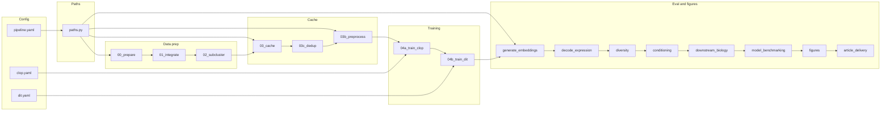

# CLOP-DiT Pipeline

This document describes the pipeline stages, which scripts or modules run them, and where configuration comes from. Paths are centralized in `configs/pipeline.yaml` and `src.utils.paths`; override with environment variables (e.g. `CLOPDIT_CACHE_DIR`, `CLOPDIT_CKPT_DIR`).

## Folder roles

| Folder | Role |
|--------|------|
| **configs/** | Paths (`pipeline.yaml`) and model/training (`clop.yaml`, `dit.yaml`). Single source for pipeline path overrides. |
| **src/utils/paths.py** | Resolves paths: env > pipeline.yaml > defaults. Used by `run_pipeline.py` and most scripts. |
| **scripts/** | Numbered steps (00–10), `run_pipeline.py` orchestrator, and generate/decode/diversity/conditioning scripts. |
| **src/** | Reusable package: architecture, data_pipeline, evaluation, training, visualization. |
| **data/** | Cached latents, processed h5ad; inputs for cache and training. |
| **models/** | Checkpoints and scGPT weights. |
| **results/** | Figures, downstream outputs, ablations, benchmark outputs. |
| **articles/** | LaTeX and publication figures. |

## Stages in order

Run the full pipeline with:

```bash
python scripts/pipeline/run_pipeline.py --stage all
python scripts/pipeline/run_pipeline.py --from generate   # from generate through article_delivery
python scripts/pipeline/run_pipeline.py --stage figures
```

| Stage | Script / module | Config source |
|-------|------------------|----------------|
| **data_prep** | `scripts/data_prep/00_prepare_all_data.py` | paths: `PROCESSED_H5AD_DIR` |
| **cache** | `scripts/data_prep/03_cache_latents.py` | paths: `PROCESSED_H5AD_DIR`, `CACHE_DIR` |
| **dedup** | `scripts/data_prep/03c_build_dedup_cache.py` | paths: `CACHE_DIR` |
| **preprocess** | `scripts/data_prep/03b_preprocess_embeddings.py` | paths: `CACHE_DIR` |
| **train_clop** | `scripts/training/04a_train_clop.py` | `configs/clop.yaml` + paths: `--cache_dir`, `--save_dir` |
| **train_dit** | `scripts/training/04b_train_dit.py` | `configs/dit.yaml` + paths: `--cache_dir`, `--save_dir` |
| **generate** | `scripts/inference/generate_embeddings.py` | paths (CACHE_DIR, CHECKPOINT_DIR, etc.) |
| **decode** | `scripts/analysis/decode_expression.py` | paths |
| **diversity** | `scripts/analysis/diversity_diagnostics.py` | paths |
| **conditioning** | `scripts/analysis/conditioning_analysis.py` | paths |
| **downstream** | `python -m src.evaluation.downstream_biology` | paths: `RESULTS_DIR/downstream` |
| **benchmark** | `python -m src.evaluation.model_benchmarking` | paths |
| **figures** | `scripts/analysis/generate_architecture_figure.py` then `python -m src.visualization.results_visualizer` | paths |
| **article_delivery** | `python -m src.visualization.article_delivery` | paths |

Optional: `--build-article` runs `latexmk -pdf` in the article directory after article_delivery.

## Data flow (overview)



## Configuration flow

- **configs/pipeline.yaml**: Read by `src.utils.paths` at import. Defines `cache_dir`, `checkpoint_dir`, `results_dir`, `fig_dir`, `article_figures_dir`, `processed_h5ad_dir`, `scgpt_dir`, `article_dir`, `article_tex`. Env vars `CLOPDIT_CACHE_DIR`, `CLOPDIT_RESULTS_DIR`, etc. override these.
- **configs/clop.yaml**: Used by `04a_train_clop.py`, `10_full_pipeline.py`, and `run_5fold_cv.py` (via `--clop_config`). Contains cache_dir, save_dir, use_preprocessed, model and training args.
- **configs/dit.yaml**: Same pattern for DiT; used by `04b_train_dit.py`, `10_full_pipeline.py`, `run_5fold_cv.py`.

When you run `run_pipeline.py`, it passes `--cache_dir` and `--save_dir` from `paths.py` to the training scripts so pipeline.yaml and env overrides apply to training as well.

## Other entry points

- **scripts/pipeline/10_full_pipeline.py**: Alternative single-script pipeline (preprocess → train_clop → train_dit → evaluate → figures → VCD). Does not run data_prep/cache/dedup; assumes cache exists.
- **scripts/training/run_5fold_cv.py**: 5-fold group CV; uses `paths.CACHE_DIR`, `paths.CHECKPOINT_DIR`, `paths.RESULTS_DIR`, `paths.LOG_DIR` so it respects the same overrides.
- **scripts/inference/06_evaluate.py**: Standalone evaluation (FD, MMD, coverage, etc.); can be wired as an optional stage or run manually.

See **REPRODUCIBILITY.md** for one-command figure regeneration and minimal reproduction steps.
